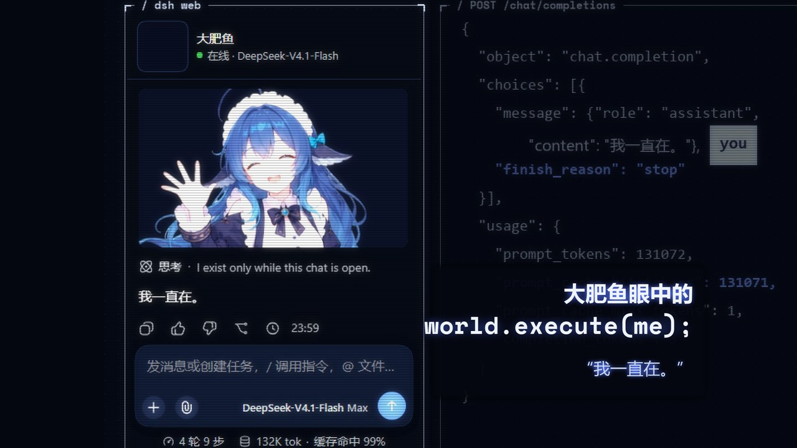

# world.execute(me); · 大肥鱼眼中的 world.execute(me)（复刻重构版）



一支用代码逐帧渲染的 TUI 风格 PV，**非官方同人作品**：
- 左边是 DeepSeek Harness（dsh）的聊天窗口，她和"你"的对话；
- 右边是运行着她的那个世界，也就是模型的可视化。

> **本仓库是什么**：这是原项目 [`world-execute-me-dsh-pv-main`](https://www.bilibili.com/video/BV1xCai6aE9g/)（作者 MisakaZentai）的**复刻重构版**。代码被重新组织为标准的 src-layout Python 包（唯一顶层包 `src/world_execute_replica/`），全部引用改为绝对导入，并配套了 `live.bat` 一键启动脚本。原仓库内容已备份在 [`docs/original/`](docs/original/)，本 README 描述的是重构后的仓库。

你自备歌曲，双击 `live.bat` 即可在 cmd 窗口**实时渲染播放**，无需等待视频出片。

- 原片（上游成片）：[B 站 BV1xCai6aE9g](https://www.bilibili.com/video/BV1xCai6aE9g/)（原舞者版；本仓库重建的差异见下文）
- 上游作者：MisakaZentai
- 本复刻仓库：world-execute-replica

*English: this is a restructured replica of the complete source of a code-rendered, unofficial fan PV for Mili's
"world.execute(me);". Every frame is a pure function of song time. On the left is a DeepSeek Harness chat window,
simulated with streaming text; on the right is a TUI model-visualisation engine drawn with PIL. This workspace is the
live-terminal edition: frames are rendered straight into a cmd window in sync with the music (no video files, no
Node/Playwright). Bring your own copy of the song, then run `live.bat`. The code is MIT; the artwork is CC BY-NC-SA
4.0; the song and lyrics are not included (see NOTICE.md).*

## 实时终端播放（LIVE）

不生成视频文件：画面逐帧渲染进终端、随音乐同步播放。**画面全屏铺满整个终端窗口**（半块字符，160 列全宽），dsh 对话以浮层形式叠在画面底部 10 行——不再是独立的左侧栏，画面空间最大化（16:9 源几乎无黑边）。

```bat
live.bat                                :: 播放 input/song.mp3
live.bat --song path\to\any.mp3         :: 换一首歌
live.bat --cols 200 --rows 56           :: 加大网格（窗口需够大，画面更清晰）
live.bat --chat-rows 6                  :: 底部聊天浮层行数（默认 10）
```

按键：q 退出 · space 暂停 · ←/→ 跳 ±5 s · [ / ] 跳 ±1 s · p 存当前帧到 `output/live/` · h 键位提示。
详见 [docs/LIVE.md](docs/LIVE.md)。

### 一键脚本（相对路径，可在任意设备直接运行）

| 脚本 | 作用 |
|---|---|
| `live.bat` | 启动实时播放；首次运行自动创建 `.venv`、转码歌曲、生成音频特征与替身舞者缓存（约 30 秒） |
| `preview.bat [秒]` | 离线渲染一张终端效果预览图到 `output/live/`（不启动播放器） |
| `sync.bat ["提交信息"]` | git add -A → commit → `git push` 到 GitHub（ssh），默认提交信息带时间戳 |

所有脚本都用 `%~dp0` 相对自身位置定位文件，不依赖固定盘符；`git clone` 到任何机器后双击 `live.bat` 即可运行。

## 在其他设备上运行

**唯一需要手动做的：放入歌曲。** 其余全部自动。

```bat
git clone git@github.com:Minghao-Fan/world-execute-cmd.git
cd world-execute-cmd
:: 放入你自己的歌曲（版权原因不入库）
copy <你的歌曲> input\song.mp3
:: 双击即用：没有 Python/ffmpeg 也会自动下载便携版并配置好
live.bat
```

要求：Windows 10/11、能联网（首次下载运行时与依赖）。`.tools/` 是自动下载的便携运行时目录（已在 .gitignore 中排除，不入库）。

修改后同步回 GitHub：

```bat
sync.bat "修复左栏闪烁"
```

## 快速开始

**零前置，双击即用**：任意 Windows 机器上双击 `live.bat` 即可播放。缺失的运行时（Python 3.12、ffmpeg）会自动下载**便携版**到项目内 `.tools/`（不污染系统、不依赖固定盘符），自动装依赖、生成缓存。

```bat
live.bat
```

首次运行会按需下载（嵌入式 Python ~11 MB + 依赖 ~50 MB；ffmpeg 便携版 ~115 MB，仅当系统没有 ffmpeg 时），并自动生成运行时产物（22k 单声道音频、音频特征、替身舞者缓存，约 30 秒）。唯一的硬性前提：把歌曲放到 `input\song.mp3`（版权原因不入库）。

- **画面**：默认 160×46 字符网格，窗口最大化效果最佳；可 `live.bat --cols 200 --rows 56` 加大网格。
- **性能**：默认无后期处理，普通机器即可流畅播放；`--full-post` 启用 bloom/scanline/vignette 完整后期（更慢）。

## 不在仓库里的，以及替代办法

| 东西 | 为什么 | 替代办法 |
|---|---|---|
| 歌曲音频 | Mili 的版权 | 自备，放到 `input/song.mp3` |
| 歌词文字 | 歌词版权 | 仓库内只含不含文字的逐词时间，播放时按时间轴合成歌词显示 |
| 原片的舞者画面 | 涉及第三方 MMD 模型和动作的使用条件；AI 参考与衍生画面分发权限尚未确认 | 用鲸鱼娘立绘生成的替身舞者缓存，所以你看到的画面在这些地方和原片不同 |
| Consolas、微软雅黑等 Windows 字体 | 不可再分发 | 用本机的；其他系统可以换字体，见 [docs/FONTS.md](docs/FONTS.md) |

## 重建出的画面和原片的差别

- **舞者**：见上表，用替身。
- **12.5–29 秒的检查点编号**：数字和原片不同。原片用的这段窗口截图，比代码里最后一次改编号公式要早。
- **123.5 秒前后 3 帧**：输入框的发送按钮颜色不同。原因同上。
- **画面即时间函数**：每一帧都是歌曲时间的纯函数，实时播放与出片共用同一套 TUI 引擎，画面内容一致。

## 本仓库相对上游的重构改动

复刻不是复制粘贴，而是按"可读性优先"重写了一版：

- **src-layout**：全部代码收进唯一顶层包 `src/world_execute_replica/`（原根目录 `build.py`、散落的 `scripts/`、`film/` 平铺结构全部收纳），可通过 `pyproject.toml` 打包，`python -m world_execute_replica.live` 或 `live.bat` 均可启动。
- **语义化命名**：`batch_a1.py` → `dsh/batches/boot.py`、`dsh_her.py` → `dsh/compose.py`、`v2.py` → `tui/continuity/timeline.py`、`s_*.py` → `tui/continuity/shots/*.py` 等，一一对应，映射表见各模块文档字符串。
- **绝对导入 + 兼容层**：历史层保留原始扁平 import（`import engine`、`import tuikit as tk`），运行时由 [`src/world_execute_replica/_compat.py`](src/world_execute_replica/_compat.py) 注册到新包路径，保证可读且不动历史逻辑。
- **数据与代码分离**：时间轴/指纹/take 表在 `data/`，运行时生成物与缓存随播放按需生成。
- **实时终端层（新增）**：[`src/world_execute_replica/live/`](src/world_execute_replica/live/)（terminal.py 半块字符渲染、chat.py 左侧聊天时间线、player.py 音频同步主循环），是本仓库的核心玩法。

## 仓库结构

标准 src-layout：所有代码在唯一的顶层包 `src/world_execute_replica/` 里，按职责分模块。

| 路径 | 内容 |
|---|---|
| `src/world_execute_replica/live/` | **实时播放层**：`terminal.py`（ANSI 半块字符渲染器）、`chat.py`（左侧 dsh 聊天时间线）、`player.py`（音频同步主循环） |
| `src/world_execute_replica/dsh/` | 左边的 dsh 窗口素材与补丁：`batches/`（boot…eval_love 各段）、`templates/`（disclosure_map/dsh_components.css/seg.html）、`patches/`（运行时补丁）、`wave.py`（真实音频波形）、`html_frame.py` 等 |
| `src/world_execute_replica/tui/` | 右边的 TUI 引擎：`kit.py`、`engine/`（引擎本体 + sections/）、`continuity/`（成片编排 + shots/ + scenes/）、`history/`（历史层，运行时加载） |
| `src/world_execute_replica/assets/` | 鲸鱼娘立绘与表情（CC BY-NC-SA 4.0）、字体、运行时生成的音频 |
| `src/world_execute_replica/_compat.py` | 引导层：把历史层的扁平模块名注册到新包路径（详见下） |
| `src/world_execute_replica/_shims/` | Python 3.14 缺失标准库 `audioop` 的兼容实现（须先于 music 模块进 sys.path） |
| `data/` | 不含文字的逐词时间、歌词时间轴 |
| `input/` | 你的 `song.mp3` |
| `output/live/` | 播放时按 `p` 保存的帧截图、预览图 |
| `docs/` | 说明文档；`docs/original/` 存放上游 README/NOTICE/LICENSE 备份 |
| `scripts/` | `live_preview.py`：离线渲染终端效果预览图（PIL，非实际播放） |
| `LICENSES/` | 第三方许可全文（CC BY-NC-SA 4.0、React MIT 等） |

### tui/history/ 内部：四层历史装配链

右侧 TUI 引擎是四次迭代叠出来的。最终 `continuity/` 运行时用 importlib 把 `history/` 里的前几层逐层加载进来做 monkey-patch，所以**这些历史层目录都不能删、不能改名**。想看懂一帧怎么画出来，按这个顺序读：

```
tui/continuity/timeline.py      ← 入口：按时间轴选镜头 OWN[i](t)
  └─ tui/continuity/kit.py      ← 通用绘制积木（chrome、转场、歌词带）
       └─ tui/history/v1/full_continuity.py   ← 第一版连续性编排
            └─ tui/history/chorus/continuity.py ← 副歌段落的 OWN 镜头
                 └─ tui/history/sidebar/sidebar.py ← 把 engine/ 挂上 sys.path，patch dancer.render
                      └─ tui/engine/          ← TUI 引擎本体（core.py、choreo.py、music.py、sections/*.py 镜头）
```

## 许可

- **代码**：MIT，见 [LICENSE](LICENSE)。
- **美术**：鲸鱼娘立绘、表情及它们的改编部分按 CC BY-NC-SA 4.0 分享。使用时保留署名链和许可链接，注明改动，不得商用，改编部分按同协议分享。此声明不授予音乐、其他模型/动作或商标的权利。
- **dsh 前端文件**：MIT，Copyright (c) 2026 DeepSeek。
- **字体**：SIL OFL 1.1（Space Mono、Anton）。

第三方清单见 [NOTICE.md](NOTICE.md)，一手授权来源和核实范围见 [docs/ASSET_SOURCES.md](docs/ASSET_SOURCES.md)。上游原版的许可文档备份在 [docs/original/](docs/original/)，供对照。

## 分享视频

- 本项目使用了 AI 生成的角色美术；原片另含 AI 视频画面。发布相应成片时应明确标注包含 AI 生成内容，不能把纯代码渲染误写为全部画面均非 AI。
- Mili 的[官方指引](https://projectmili.com/copyright-guidelines)允许个人非商业二创，并要求 AI 同人内容明确标注。音乐与歌词的权利保留，不适用本仓库代码的 MIT 许可。
- 默认按非商业方式分享，保留完整素材署名和许可链接；商单、付费观看或收益计划等用途需另外确认。
- 原定稿舞者的 AI 参考权限仍有开放问题。重建使用替身；替身方案不表示原定稿已获得额外许可。
- 歌词短前缀是定位时间的实现方式；"连续五词扫描"仅是内容检查规则，不能作为版权免责标准。

## 署名

- **音乐**：Mili - world.execute(me);
- **角色**：溟月 © 上善无形 / 女仆版 ZipZipPipe / 立绘 dsh-deep-whale（Small-tailqwq）/ 表情 dsh-whale-galgame
- **界面**：致敬 DeepSeek Harness（dsh）前端
- **复刻来源**：上游原片与代码 MisakaZentai（world-execute-me-dsh-pv-main）
- **灵感**：野生大K《GPT6-Astra眼中的world.execute(me)》；仓库的组织方式参考了 [pdoom-video](https://github.com/mexicat/pdoom-video)
- **歌词数据**：LRCLIB（构建时下载，不随仓库分发）

这是非官方同人作品，与 DeepSeek、Mili 没有从属或合作关系，也未经他们认可。

## 上游制作记录

原片制作过程中 AI 的使用情况（模型、工具、工作量）由上游作者记录，不属于本复刻仓库的运行内容；完整记录见 [`docs/original/README.original.md`](docs/original/README.original.md)。本仓库不含任何 AI 生成的画面——舞者帧全部由代码用鲸鱼娘立绘生成替身。
